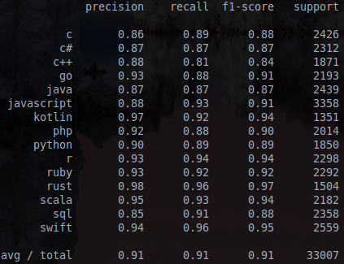

# Stack Overflow data playground

(data mining / university project)

Trying out various data mining techniques (mostly classification and topic
discovery) on a collection of Stack Overflow questions.

Mostly played with classification, using Multinomial Naive Bayes and Support
Vector Machine, but also using Latent Dirichlet Analysis and Non-Negative Matrix
Factorization (which were patched to act as classifiers, though with mixed
success). Also tried out Vader sentiment analysis.

The data set was downloaded with [this tool](https://github.com/ijovan/POP).

*SVM classification score*
